# WeKan 사용자 매뉴얼 및 커스터마이징 가이드

WeKan은 카드 기반의 협업 관리 도구로, 템플릿 관리, 사용자 정의 필드, 웹훅 등 다양한 기능을 제공합니다. 아래 매뉴얼은 커스터마이징 한 WeKan을 설치하고 사용하는 방법(템플릿, 사용자 정의 필드로 TAG 불러오기, 웹훅 특정 기능)과 코드를 커스터마이징하는 방법을 포함하고 있습니다.

---

## **1. WeKan 사용자 매뉴얼**

### **1.1 카드 템플릿 기능**

#### **템플릿 생성**
1. **Card Templates** 버튼 클릭  
   - 보드 상단 메뉴에서 **"card-Templates"** 버튼을 클릭하여 템플릿 관리 사이드바를 엽니다.  
     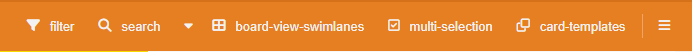
2. **새 템플릿 추가**
   - **템플릿 이름** 입력
   - **API URL** 입력 (선택 사항)
   - **설명** 입력
   - **"Create"** 버튼 클릭  
     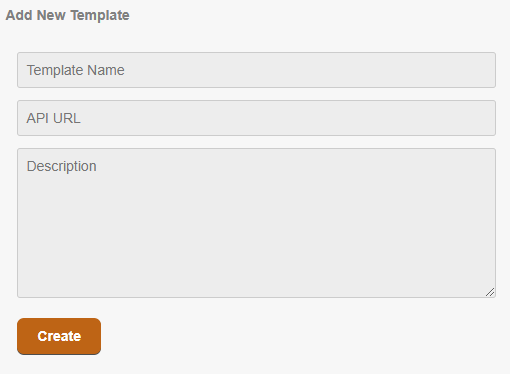

#### **API 템플릿 사용**
- API URL이 설정된 템플릿은 자동으로 API에서 하위 템플릿을 가져옵니다.
- 각 하위 템플릿은 독립된 카드로 생성할 수 있습니다.
- 템플릿 활성화 또는 비활성화 가능.

#### **템플릿으로 카드 생성**
1. 템플릿 목록에서 원하는 템플릿 선택.
   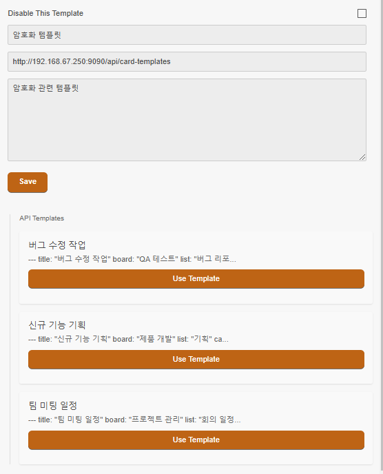
2. 팝업 창에서 카드 정보를 입력:
   - 카드 제목
   - Swimlane
   - 리스트
3. **"Create Card"** 버튼 클릭 시 카드 생성.
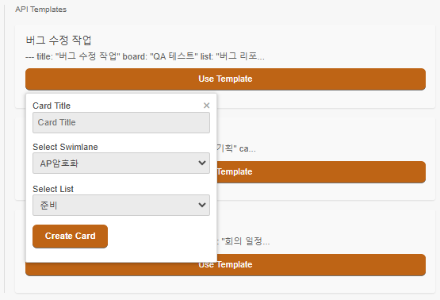

템플릿 데이터 형식
```
{
   "files": [
      {   id: "card-002",
          title: "신규 기능 기획",
          description: ""
      },
      { ... },
      { ... }, 
   ]
}
```
---

### **1.2 사용자 정의 필드**

#### **API 드롭다운 필드 설정**
1. **Custom Fields** 메뉴 열기  
   - ≡(side Bar 버튼) -> 보드 설정(BoardMenuPopup Title) → **Custom Fields** 클릭.  
     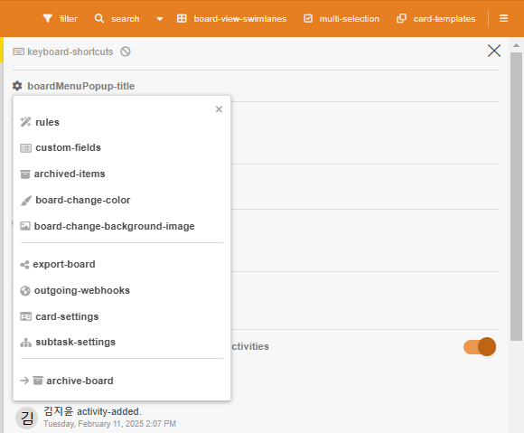
2. 새로운 필드 생성:
   - **"createCustomField"** 버튼 클릭.
   - 필드 이름 입력.
   - **Type**에서 **"custom-field-apiDropdown"** 선택.
   - API URL과 메서드(GET/POST) 설정.
   - 파라미터 구분값 / 설정 불가(고정 값).
   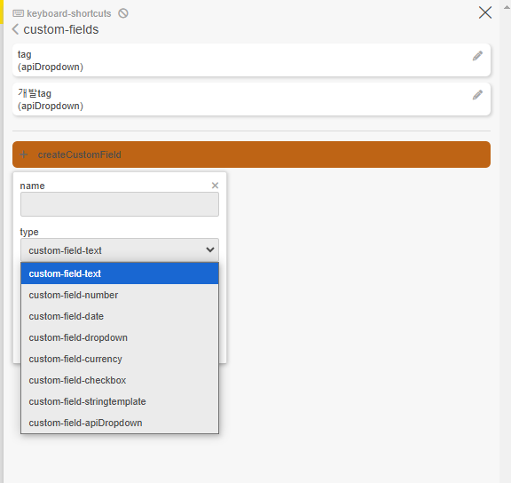
   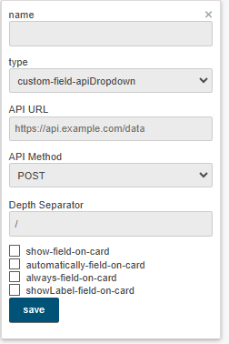
   - 필요한 옵션을 체크.
      - Show Field on Card: 카드에 해당 필드를 표시합니다.
      - Automatically Field on Card: 새로 생성된 카드에 필드를 자동으로 추가합니다.
      - Always Field on Card: 모든 카드에서 필드를 항상 표시합니다.
      - Show Label Field on Card: 필드 레이블을 카드에 표시합니다.
   - 옵션 체크 없이 커스텀 필드 카드에 추가.
      - ≡ → **card-edit-custom-fields** 클릭.
      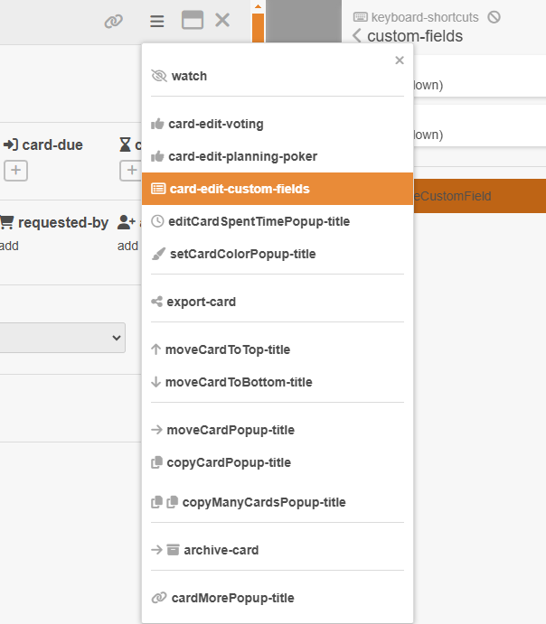
3. 설정 후, 카드에서 API 응답 데이터를 기반으로 값을 선택 가능.  
   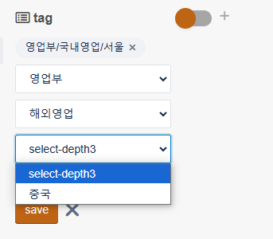
   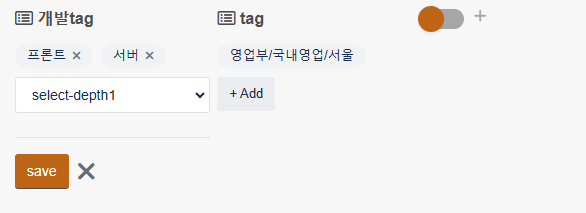
4. category 키 안에 value 는 배열안에 객체의 형태를 지니고 있으면 CategoryCd , SecondCategoryCd , ThirdCategory 키 값은 동일하다.
   * 3뎁스로 제한

```
"customFields": {
      "category": [
        {
          "CategoryCd": "P0",
          "SecondCategoryCd": "A0",
          "ThirdCategory": "B0"
        },
        {
          "CategoryCd": "P0",
          "SecondCategoryCd": "D0",
          "ThirdCategory": "M0"
        }
      ],
      "dd": "ddd"
    }
```
---

### **1.3 웹훅 알림**

#### **카드 이동 알림**
- 특정 리스트(준비 -> 시작)로 카드 이동 시 자동으로 웹훅 발송.
- 발송 이력을 캐시로 저장하며 단 1회만 전송 
- `event: 'cardMovedToStart'`를 제외한 wekan 기존 웹훅 이벤트 모두 발생
- 발송되는 데이터:
  - 카드 ID, 제목, 설명
  - 라벨, 담당자
  - 사용자 정의 필드 값
  - 날짜 정보(시작일, 종료일 등)
  - 첨부 파일
    : Base64로 인코딩한 값을 보내고 있습니다. API 쪽에서는 그걸 Buffer로 디코딩해서 원본 파일로 만들면 됨.
```
{
  event: 'cardMovedToStart',
  card: {
    id: 'tznc84YDzcNyBvMsu',
    title: '[REQ_AP암호화_001_01] 암호화 Readme 작성',    description: '# 개요\n' +
      '\n' +
      '> 이 문서는 Key Manager 서비스의 README로, AP와
 ADAMS 간 암호화 키 전달을 위한 메시지 시뮬레이터의 설
치 및 사용법을 설명합니다.\n' +
      '\n' +
      '## 목차\n' +
      '\n' +
      '1. [message-흐름](#1-message-흐름)\n' +        
      '2. [구성](#2-구성)\n' +
      '   * [2.1. Windows](#21-windows)\n' +
      '   * [2.2. Linux](#22-linux)\n' +
      '   * [2.3. 공통](#23-공통)\n' +
      '3. [설치 방법](#3-설치-방법)\n' +
      '   * [3.1. Docker container 의 image load](#31-docker-container-의-image-loadpowershell-linuxshell-동
일)\n' +
      '   * [3.2. 설정 수정](#32-설정-수정)\n' +      
      '   * [3.3. SQL의 모델 추가](#33-sql의-모델-추가
)\n' +
      '   * [3.4. Docker Compose 실행 및 중지](#34-docker-compose-실행-및-중지)\n' +
      '4. [점검](#4-점검)\n' +
      '   * [4.1. 실행 확인](#41-실행-확인powershell-linuxshell-동일)\n' +
      '   * [4.2. 종료 확인](#42-종료-확인)\n' +      
      '   * [4.3. service 테스트 방법](#43-service-테 
스트-방법)\n' +
      '      * [4.3.1. http 테스트](#431-http-테스트)\n' +
      '      * [4.3.2. https 테스트](#432-https-테스트
)\n' +
      '   * [4.4. x-check-header](#44-x-check-header)\n' +
      '   * [4.5. 로그 및 에러 예시](#45-로그-및-에러-예시)\n' +
      '5. [장비 모델 추가 시나리오](#5-장비-모델-추가-시나리오)\n' +
      '6. [PACKET 구성](#6-packet-구성)\n' +
      '   * [6.1. 용어 정의](#61-용어-정의)\n' +      
      '   * [6.2. HP Protocol](#62-hp-protocol)\n' +  
      '   * [6.3. SNMP Trap Protocol](#63-snmp-trap-protocol)\n' +
      '   * [6.4. SNMP Protocol](#64-snmp-getsetwalkprotocol)\n' +
      '   * [6.5. SYSLOG](#65-syslog)\n' +
      '7. [참고 자료](#7-참고-자료)\n' +
      '8. [TO DO](#8-to-do)\n' +
      '\n' +
      '까지 작성',
    listName: '시작',
    labels: [ '문서' ],
    user: '김지윤',
    "customFields": {
      "category": [
        {
          "CategoryCd": "P0",
          "SecondCategoryCd": "A0",
          "ThirdCategory": "B0"
        },
        {
          "CategoryCd": "P0",
          "SecondCategoryCd": "D0",
          "ThirdCategory": "M0"
        }
      ],
      "dd": "ddd"
    }
    members: [ '김지윤', '이시은' ],
    assignees: [ '김지윤', '이시은' ],
    dates: {
      received: '2025-01-27T04:57:00.000Z',
      start: '2025-01-27T04:57:00.000Z',
      due: '2025-01-31T08:00:00.000Z',
      end: null
    },
    "attachments": [
      {
        "id": "6853aa19f9ec9de65bb64d61",
        "name": "docker-compose.yml",
        "type": "application/octet-stream",
        "size": 38429,
        "storageStrategy": "filesystem",
        "url": "http://localhost:3000/cdn/storage/attachments/6853aa19f9ec9de65bb64d61/original/6853aa19f9ec9de65bb64d61.yml",
        "data": "IyBOb3RlOiBEbyBub3QgYWRkIHNpb......lDQo=",
        "isModified": false
      },
      {
        "id": "6853aa19f9ec9de65bb64d62",
        "name": "Dockerfile",
        "type": "application/octet-stream",
        "size": 7481,
        "storageStrategy": "filesystem",
        "url": "http://localhost:3000/cdn/storage/attachments/6853aa19f9ec9de65bb64d62/original/6853aa19f9ec9de65bb64d62.",
        "data": "RlJPTSBzY3JhdGNoIEFTIGRvd.....",
        "isModified": false
      },
      {
        "id": "6853aa19f9ec9de65bb64d63",
        "name": "wekan.md",
        "type": "application/octet-stream",
        "size": 9191,
        "storageStrategy": "filesystem",
        "url": "http://localhost:3000/cdn/storage/attachments/6853aa19f9ec9de65bb64d63/original/6853aa19f9ec9de65bb64d63.md",
        "data": "Iy....",
        "isModified": false
      }
    ]
  }
}
```
- **설정 방법**:
  - 보드 설정 → **Outgoing Webhooks** 메뉴 클릭.
    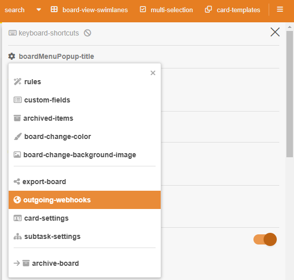
  - Webhook Name, URL, 인증 토큰(optional) 설정.  
    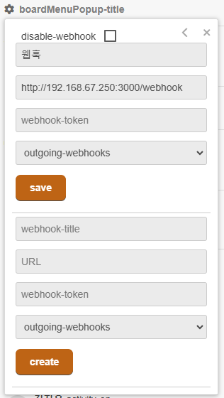

---

## **2. WeKan 설치 및 실행 방법**

### **2.1 기존 저장소 사용**
1. **WeKan 저장소 클론**:
   ```bash
   git clone https://github.com/kimjijiyoon/wekan-docker.git
   cd wekan-docker
   ```

2. **Docker Compose 실행**:
   - 이미지 빌드부터 Docker Compose까지 한번에 WeKan 실행:
     ```bash
     docker-compose -f docker_compose.yml up --build -d
     ```
   - 이미지 tar로 다운 후 WeKan 실행:
     ```bash
     docker load -i wekan.tar

     PS C:\wekan78> docker images
     REPOSITORY                  TAG       IMAGE ID       CREATED         SIZE
     ghcr.io/wekan/wekan         latest    ad09ffd5f3c3   9 hours ago     495MB

     docker-compose -f docker_compose.yml up -d
     //docker save -o wekan_v4.tar ghcr.io/wekan/wekan 이미지 tar 로 저장하는 법
     ```
---

### **2.2 커스텀 저장소 사용**

#### **Dockerfile 수정**
1. **커스터마이징한 저장소** 사용:
   - Dockerfile에서 아래 값을 변경합니다:
     ```dockerfile
     ARG REPO_URL="https://github.com/your-username/your-custom-wekan.git"
     ARG BRANCH="master"
     ```

2. **이미지 빌드**:
   ```bash
   docker build -t custom-wekan .
   ```

3. **Docker Compose 수정**:
   - `docker-compose.yml`에서 `wekan` 이미지 이름을 커스텀 이미지로 변경:
     ```yaml
     services:
       wekan:
         image: custom-wekan
     ```

4. **Docker Compose 실행**:
   ```bash
   docker-compose up -d
   ```

---

## **3. WeKan 커스터마이징 가이드**

### **3.1 코드 수정 및 저장**
1. **WeKan 저장소 클론**:
   ```bash
   git clone https://github.com/kimjijiyoon/wekan.git
   cd wekan
   ```

2. **코드 수정**:
   - 필요한 부분을 수정합니다.
   - 수정 후 변경 사항을 커밋하고 새로운 저장소에 푸시합니다:
     ```bash
     git init
     git remote add origin https://github.com/your-username/your-custom-wekan.git
     git add .
     git commit -m "Custom changes to WeKan"
     git push -u origin master
     ```

3. **Dockerfile 수정**:
   - 커스터마이징한 저장소를 사용하려면 Dockerfile에서 `REPO_URL`을 수정합니다:
     ```dockerfile
     ARG REPO_URL="https://github.com/your-username/your-custom-wekan.git"
     ARG BRANCH="custom-branch"
     ```

---

### **4. FAQ**
1. **Docker 실행 중 문제가 발생할 경우**
   - `docker-compose logs` 명령어로 로그를 확인하세요.

2. **커스터마이징한 코드를 적용했는데 반영되지 않을 때**
   - Dockerfile이 올바르게 수정되었는지 확인하세요.
   - Docker 이미지를 다시 빌드합니다:
     ```bash
     docker-compose down
     docker-compose build
     docker-compose up -d
     ```
